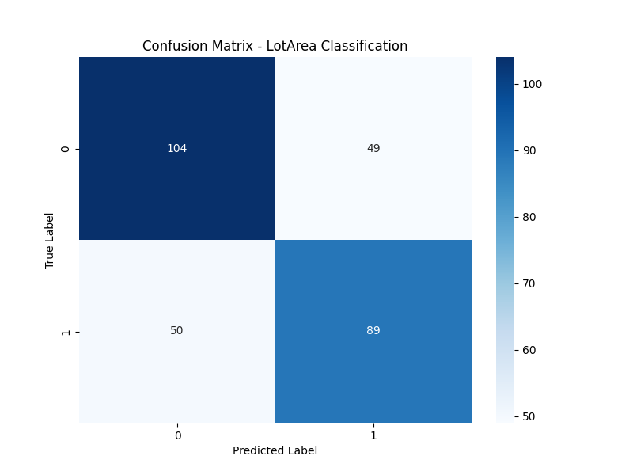

# 🏠 Iowa Housing Price Analysis & Predictive Modeling

This project demonstrates a comprehensive **Machine Learning pipeline** using the Iowa Housing dataset. It covers the entire process from automated data ingestion and preprocessing to advanced regression and binary classification tasks.

## 🛠️ Engineering Highlights
* **Automated Data Ingestion:** Integrated the `kagglehub` API to dynamically download and verify the latest version of the dataset.
* **Robust Preprocessing:** * Implemented **Mean Imputation** to handle missing values efficiently.
    * Applied strict **Data Leakage** prevention by isolating target variables from features during the training process.
* **Model Optimization:** Conducted hyperparameter tuning for `max_leaf_nodes` to identify the optimal balance between model complexity and generalization.
* **Ensemble Learning:** Transitioned from a single **Decision Tree** to a **Random Forest Regressor**, significantly improving prediction stability and reducing Mean Absolute Error (MAE).

## 🎯 Classification & Problem Transformation
Beyond regression, the project transforms the task into a **Binary Classification** problem by segmenting `LotArea` based on its median value. This approach allows for a deeper analysis of model performance using diverse metrics.

### Performance Metrics:
* **Accuracy:** Overall correctness of the model.
* **Precision & Recall:** Evaluation of the model's ability to identify positive classes correctly.
* **Specificity:** Analysis of the model's performance on negative class detection.

### Confusion Matrix Visualization
The following heatmap provides a granular view of the classification results, highlighting True Positives, True Negatives, and misclassifications:

<p align="center">
  
</p>


## 🚀 Setup & Installation
1. Clone the repository:
   ```bash
   git clone [https://github.com/RelonViFleppy/Iowa-Housing-ML.git](https://github.com/RelonViFleppy/Iowa-Housing-ML.git)

2. Install the required dependencies:
   pip install kagglehub pandas scikit-learn matplotlib seaborn
   
4. Run the analysis:
   python ml.py
